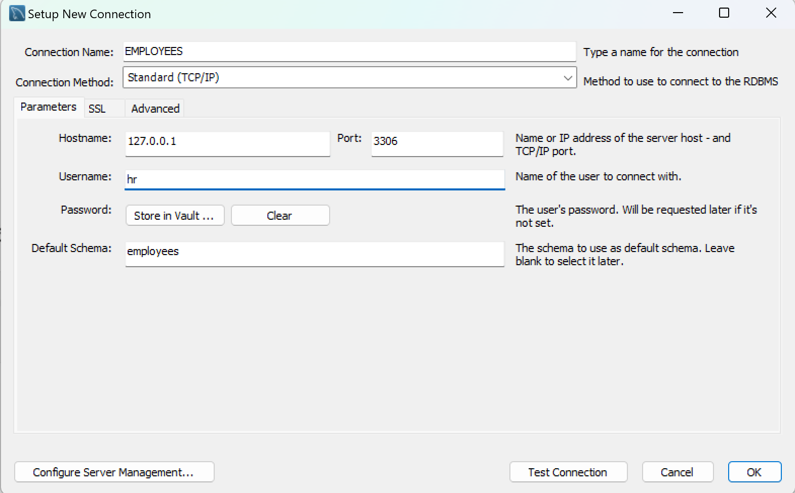
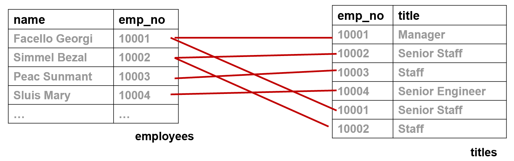
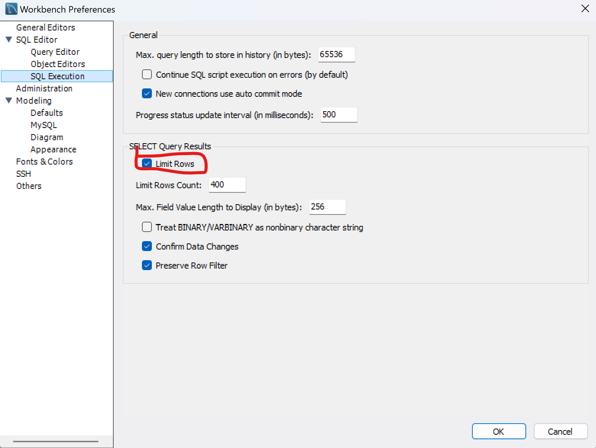

# 💻 실습

- 실습 내용입니다.

<br>

```mysql
select version(), current_date(), now() from dual;

-- 수학 함수도 사용 할 수 있다. (사칙 연산도 가능)

SELECT SIN(PI() / 4), 1+2 * 3-4/5 FROM DUAL;

-- 대소문자 구분 안한다.
select version(), current_date(), now() from Dual;

```


```mysql

-- tabel 생성 :DDL
create table pet(
                    name varchar(100),
                    owner varchar(20),
                    species varchar(20),
                    gerder char(1), -- 성별
                    birth date, -- 생일
                    death date -- 죽은날
);

-- schema 확인
show tables;
desc pet;

-- schema 삭제 DDL
drop table pet;
show tables;
```
</br></br>

</br>

체크해제


</br>
```mysql
-- insert : DML (C)
insert into pet value('성탄이', '안대혁', 'dog', 'm','2019-12-25',null);

-- select: DML (R)
select * from pet;

-- update: DML(U)
update pet set name = '성타니' where name = '성탄이2';

-- delete: DML (D)
delete from pet where name = '성타니';
```



<br> 