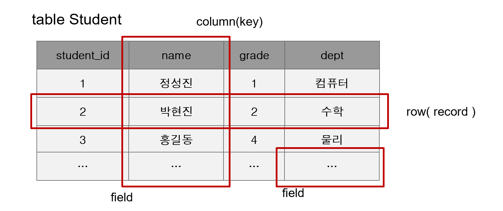
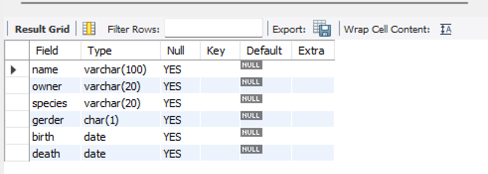
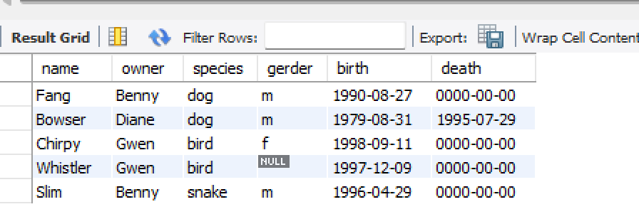
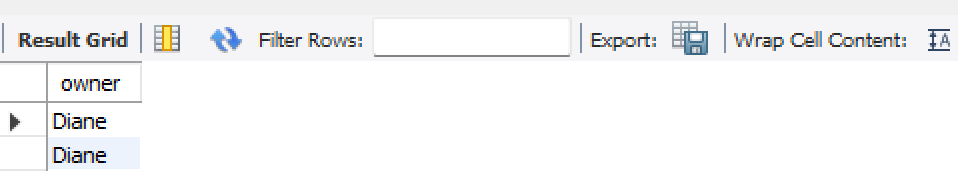

# 💻 8월 29일 실습

- 실습 내용입니다.



```mysql
테이블 : RDBMS의 기본적 저장구조   한 개 이상의 column 과 0개 이상의 row로 구성
열(Column): 테이블 상에서의 단일 종류의 데이터를 나타냄 특정 데이터 타입 및 크기를 가지고 있음 
행(Row): Column들의 값의 조합. 레코드라고 불린다.
             기본키(PK)에 의해 구분된다. 기본키는 중복을 허용하지 않으며 없어서는 안 된다. 
Field : Row 와  Column의 교차점으로 Field는 데이터를 포함할 수 있고 없을 때는 NULL 값을 가
          지고 있다고 한다.
```

<br>

```mysql
select version(), current_date(), now() from dual;

-- 수학 함수도 사용 할 수 있다. (사칙 연산도 가능)

SELECT SIN(PI() / 4), 1+2 * 3-4/5 FROM DUAL;

-- 대소문자 구분 안한다.
select version(), current_date(), now() from Dual;

```


```mysql

-- tabel 생성 :DDL
create table pet(
                    name varchar(100),
                    owner varchar(20),
                    species varchar(20),
                    gerder char(1), -- 성별
                    birth date, -- 생일
                    death date -- 죽은날
);

-- schema 확인
show tables;
desc pet;

-- schema 삭제 DDL
drop table pet;
show tables;
```
</br></br>

</br>

체크해제


</br>
```mysql
-- insert : DML (C)
insert into pet value('성탄이', '안대혁', 'dog', 'm','2019-12-25',null);

-- select: DML (R)
select * from pet;

-- update: DML(U)
update pet set name = '성타니' where name = '성탄이2';

-- delete: DML (D)
delete from pet where name = '성타니';
```


<br> 

```mysql
OPT_LOCAL_INFILE=1 설정해야 로드 잘함

-- load data
LOAD DATA LOCAL INFILE 'C:/Users/SDH/Documents/Poscodx/poscodx/mariadb-practices/pet.txt' into table pet;
```

</br>

```mysql
-- select data
-- 문) bowser의 주인의 이름은?
select owner from pet where name = 'bowser';
```




```mysql

-- 문2) 1998 이 후에 태어난 애들은?
select * from pet where birth >= '1998-01-01';

-- 문3) 종이 뱀이거나 새인 애들은?
select * from pet where species = 'snake' or species = 'bird';

-- 예4) order by
select name, birth from pet order by birth asc;

-- 예5) order by ~ desc
select name, birth from pet order by birth desc;

-- 예6) where 절에 null 다루기
select name, birth death from pet where death is null;
select name, birth death from pet where death is not null;

-- 예7) like 검색 (패턴검색)
select name from pet where name like 'b%';
select name from pet where name like '%fy';
select name from pet where name like '%w%';
select name from pet where name like '____';
select name from pet where name like 'b_____';

-- 예8 ) 집계  count avg sum max min
select count(*) from pet;
select name, max(birth) from pet;

```


## 데이터 검색 I
##### employees db restore (install)
1. db 백업 파일 (employees_db.zip)압축풀기
2. 