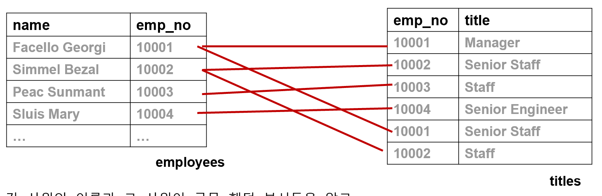
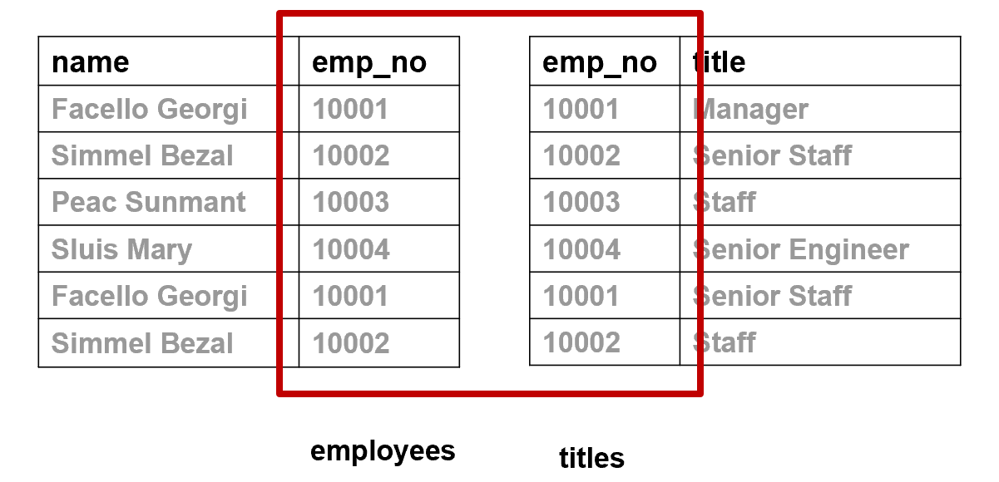
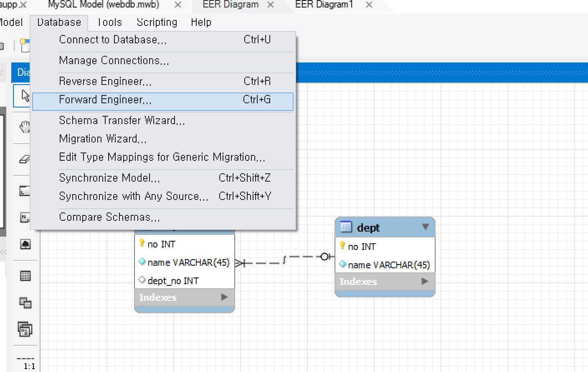
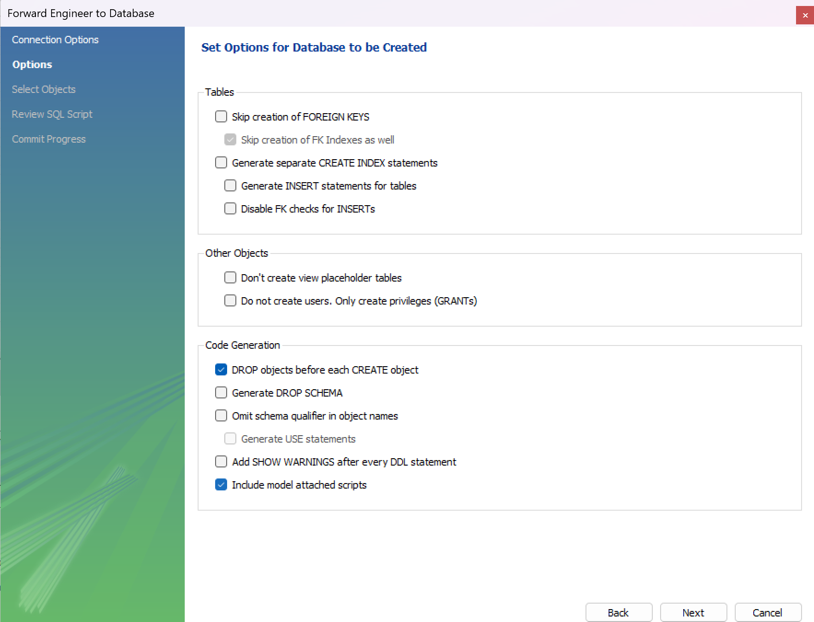

# 💻 8월 31일 실습


>조인은 데이터베이스에서 하나 이상의 테이블로부터 연관된 데이터를 가져오는 방법이다.   
Primary Key(PK)와 Foreign Key(FK)의 관계를 기반으로 조인이 이루어지며, equijoin, inner join, outer join 등의 기본 유형이 있다.

<br/>

## 2-1. 조인의 개념:

조인은 하나 이상의 테이블로부터 연관된 데이터를 가져오는 방법이다.   
주로 Primary Key(PK)와 Foreign Key(FK) 값의 관계에 의해 조인이 성립되며, 연관성이 논리적인 값들로도 성립할 수 있다.

조인의 기본 유형은 다음과 같다:
- equijoin: '='(equal) 연산자를 사용하여 조인하는 방식    
- inner join: 조인 조건을 만족하는 행에 대해서만 결과값이 나오는 조인
- outer join: 조인 조건을 만족하지 않아도 출력이 가능한 경우에 사용

<br/>

<br/>

### 2-2. EQUIJOIN 예:

값이 정확하게 일치하는 경우 '=' 연산자를 사용하여 조인을 할 수 있다. 이를 EQUIJOIN이라 한다.   
각 사원의 이름과 그 사원이 근무한 부서들을 알고 싶다면 테이블 하나로는 원하는 데이터를 얻을 수 없다.   
원래 테이블에 있는 데이터에서 점선(=관계)을 따라 합쳐보면...   

### 2-2. EQUIJOIN 예제:

값이 정확히 일치하는 경우, 하나의 테이블로 합쳐진 결과를 얻을 수 있다.

<br/>
### 2-2. EQUIJOIN의 문형:

조인을 위한 문법은 다음과 같다:
```
SELECT 테이블명.컬럼명, 테이블명.컬럼명, ...
FROM 테이블1, 테이블2
WHERE 테이블1.컬럼1 = 테이블2.컬럼2
```
여기서 테이블명.컬럼명은 데이터를 가져올 위치를 지정하며,  
테이블1.컬럼1 = 테이블2.컬럼2는 두 테이블 사이의 논리적인 연결 조건을 명시한다.

<br/>



### 2-2. EQUIJOIN의 문형:

값이 정확히 일치하는 경우 '=' 연산자를 사용하여 조인하며,   
일반적으로 PK-FK 관계에 의해 JOIN이 성립된다. WHERE 절이나 ON절을 이용해 조인 조건을 명시한다.   
액세스 효율과 가독성을 위해 칼럼 이름 앞에 테이블 이름을 명시하는 것이 좋다.    
***만약 조인 대상 테이블에 같은 이름의 칼럼이 있다면 반드시 테이블 이름을 사용해 명확하게 지정해야 한다.***    
JOIN을 위한 테이블이 N개라면 최소한의 = 조건은 N-1이다.

### 2-2. EQUIJOIN의 문형:

예제 8에서는 employees 테이블과 titles 테이블을 조인하여 사원의 이름과 직책을 출력한다.
```sql
SELECT CONCAT(employees.last_name, ' ', employees.first_name) AS name,
       employees.emp_no,
       titles.emp_no,
       titles.title
FROM employees, titles
WHERE employees.emp_no = titles.emp_no;
```

### 2-3. Alias 사용:

테이블명.칼럼명으로 기술할 때, 테이블명이 길어지면 시간이 많이 소요될 수 있다.   
이럴 때 ALIAS를 지정하여 사용하면 효율적이다. 또한 ALIAS를 사용하면 칼럼 헤딩에 대한 애매함을 피할 수 있다.   

예제 9에서는 예제 8의 결과에 각 컬럼과 테이블에 ALIAS를 지정하여 출력한다.

### 2-4. 추가적인 조건 기술:

WHERE 절에 JOIN 조건 이외의 추가적인 조건을 추가할 수 있다.    
조인을 만족하는 데이터 중 특정 행만 선택하여 결과를 얻고 싶을 때는 추가 조건을 AND로 연결해 사용한다.

예제 10에서는 employees 테이블과 titles 테이블을 조인하여 직원의 이름과 직책을 출력하되 여성 엔지니어만 출력한다.





>여기부터 놓쳤다!

```mysql
-- outer join

-- 테스트 데이터
-- insert into dept values(null, '총무');
-- insert into dept values(null, '개발');
-- insert into dept values(null, '영업');
-- insert into dept values(null, '기획');


select * from dept;

-- 테스트 데이터 
-- insert into  emp values(null, '둘리', 1);
-- insert into  emp values(null, '마이콜', 2);
-- insert into  emp values(null, '또치', 3);
-- insert into  emp values(null, '길동이', null);

select * from emp;

-- inner join
select emp.name, dept.name
from emp join dept on emp.dept_no = dept.no;

-- left join (outer join)
select emp.name as '직원', ifnull(dept.name, '없음') as '부서'
from emp left join dept on emp.dept_no = dept.no;

-- right join (outer join)
select ifnull(emp.name, '없음') as'직원', dept.name as '부서'
from emp right join dept on emp.dept_no = dept.no;

```


