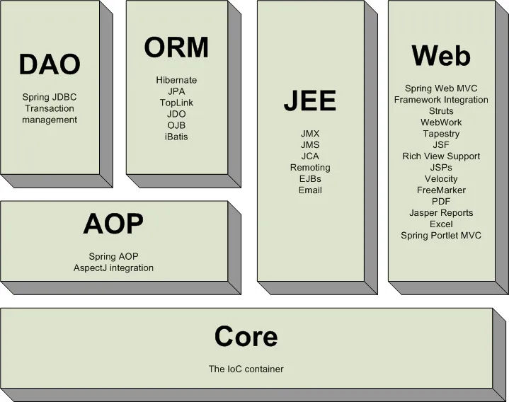

# 💻 9월 14일 실습

# 스프링(Spring)

스프링은 자바 기반의 어플리케이션 프레임워크로, 엔터프라이즈 애플리케이션 개발을 단순화하며 유연성과 테스트 용이성을 제공한다.

## 프레임워크

프레임워크는 소프트웨어의 특정 문제를 해결하기 위한 클래스와 인터페이스의 집합으로, 전체 시스템의 구조를 정의한다.   
개발자는 필요한 부분을 추가하여 완성한다.

## 스프링 어플리케이션 프레임워크

스프링 어플리케이션 프레임워크는 웹 개발뿐만 아니라 다양한 엔터프라이즈 애플리케이션 개발에 사용할 수 있다. 특정 기술에 종속되지 않으며, 자바 개발을 보다 간소화하고 확장할 수 있게 도와준다.

## EJB(Enterprise Java Bean)

EJB는 서버 측 컴포넌트 아키텍처로 비즈니스 로직을 모듈화하는데 사용된다. 복잡도가 증가함에 따라 EJB 대신 더 간단하고 유연한 솔루션이 필요해져서 스프링 같은 경량 컨테이너다 등장하게 되었다.

# 스프링 프레임워크 사용 이유

- **의존성 주입(Dependency Injection)**: 코드 간 결합도를 낮춤.
- **테스트 용이성**: JUnit 등 테스팅 프레임워크와 호환 가능.
- **AOP(Aspect-Oriented Programming)**: 관심사 분리로 코드 모듈화 가능.
- **선언적 트랜잭션 관리**: 데이터베이스 연산의 안정성과 일관성 보장.
- **다양한 모듈 지원**: 웹 MVC, 보안, RESTful 서비스 등 다양한 모듈 제공.
- **통합 프레임워크**: 자바 EE 기술과 잘 통합되며, 다른 오픈 소스 프레임워크와 호환 가능.
- **확장 가능성**: 필요에 따라 커스터마이징 및 확장 용이.