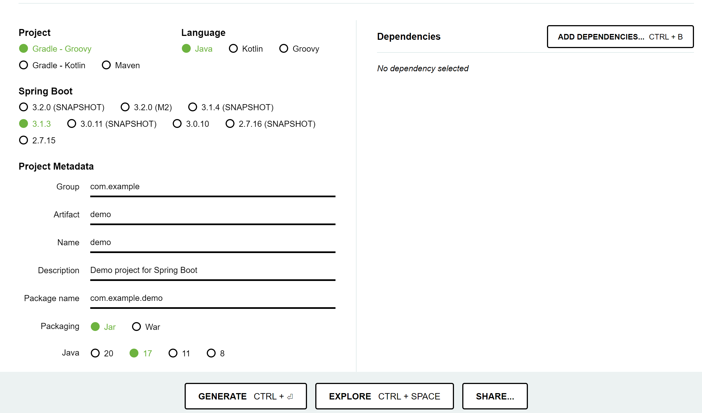
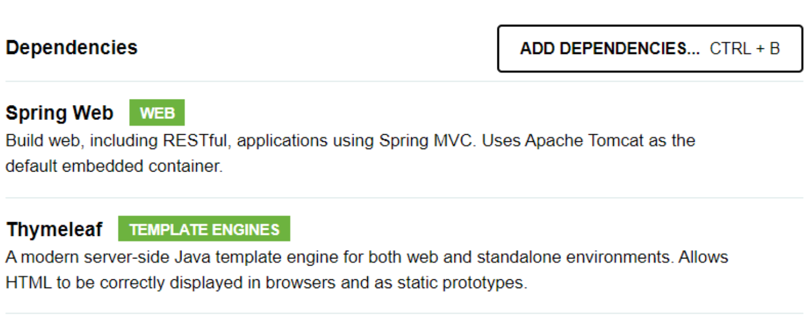
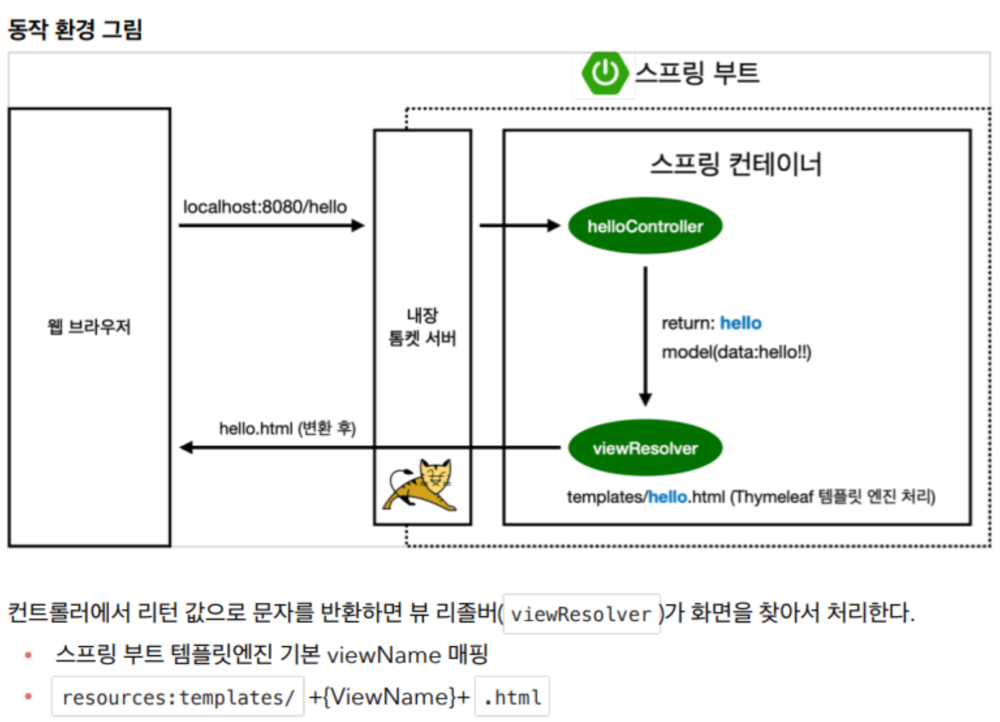

[//]: # (<🍃😕📃📁📗🖋️)
sss

## 시작하기 앞서🍃

해당 게시물은 인프런의 "스프링 입문 - 코드로 배우는 스프링 부트, 웹, MVC, DB 접근 기술" 강의를 참고하여 작성된 글입니다.   
제 공부를 위해 작성한 글로 내용이 부족할 수 있으며, HTML, CSS, JavaScript에 대한 지식만을 바탕으로 작성되었습니다.   
아래는 해당 강의의 링크입니다:

> **[김영한 - 스프링 입문 (무료강의)](인프런 강의 링크)**

📖 프로젝트 환경설정

📒 프로젝트 생성

프로젝트를 생성하기 전에 Java 11과 IntelliJ IDEA를 설치해야 합니다.
> 자바 17로 진행했습니다.

🍃 **스프링 부트 스타터**

설치가 완료되면 스프링 부트 스타터 사이트를 사용하여 스프링 프로젝트를 생성할 수 있습니다.   
스프링 부트 스타터 사이트는 스프링 부트 기반의 프로젝트를 만들어주는 도구입니다.   
아래는 스프링 부트 스타터 사이트를 사용하는 과정을 설명합니다:

<br/>



<br/>


2. "Project"는 Gradle Project를 선택합니다.

3. "Language"는 Java를 선택합니다.


4. "**Spring Boot**" 버전은 3.1.3을 선택합니다.   
여기서 "**SNAPSHOT**"은 아직 릴리스되지 않은 개발 중인 버전을 의미하며, "**M3**"는 정식 릴리스되지 않은 버전입니다.   
따라서 가장 최신의 정식 버전을 선택합니다.


5. "**Project Metadata**" 섹션에 프로젝트 정보를 입력합니다.   
"**Group**"은 보통 기업명을 사용하지만, 현재는 임의의 단어를 사용합니다.    
"**Artifact**"는 프로젝트의 이름이며, "**Name**", "**Description**", "**Package name**"은 이전에 작성한 내용과 동일하게 설정합니다.    
"**Packaging**"은 Jar로 선택하고, "Java" 버전은 11을 선택합니다.


6. "**Dependencies**" 섹션에서 **Spring We**b과 **Thymeleaf를** 선택합니다.   
이러한 **Dependencies는** 프로젝트에 필요한 라이브러리를 자동으로 추가해줍니다.


7. 설정이 완료되면 "**GENERATE**" 버튼을 클릭하여 프로젝트를 다운로드 받습니다.

8. 다운로드 받은 프로젝트를 원하는 폴더에 압축 해제합니다.

## 🍃️ 프로젝트 설명

프로젝트를 실행하기 위해 IntelliJ IDEA를 실행하고,    
압축 해제한 폴더의 build.gradle 파일을 선택하여 프로젝트를 엽니다.

프로젝트를 열면 아래와 같은 구조가 나타납니다:

- src/main/java/spring/study1: 소스 코드 및 패키지가 위치한 디렉토리
- src/main/resources: 리소스 파일 및 설정 파일이 위치한 디렉토리
- src/test: 테스트 코드 및 관련 파일이 위치한 디렉토리

build.gradle 파일은 프로젝트의 라이브러리 의존성 및 설정을 관리하는 파일입니다.

### 🍃️ 라이브러리 살펴보기 

프로젝트를 생성하면 Spring Web과 Thymeleaf와 같은 라이브러리가 자동으로 추가됩니다.   
이러한 라이브러리는 프로젝트에 필요한 의존성을 관리하며, 프로젝트가 정상적으로 동작할 수 있도록 도와줍니다.



라이브러리들의 의존 관계는 Gradle 파일에서 확인할 수 있습니다.

### 🍃️ View 환경설정

🖋️ 정적 페이지 만들기

http://localhost:8080에 접속하면 현재 아무런 페이지가 없어서 오류 페이지가 나타납니다.   
따라서 직접 페이지를 만들어주어야 합니다. 이를 위해 src/main/resources/static 폴더에 index.html 파일을 생성합니다.   
이 파일은 정적인 페이지로 사용될 것입니다.

index.html에는 다음과 같은 HTML 코드를 작성합니다:

```html
<!DOCTYPE HTML>
<html>
    <head>
        <title>Hello</title>
        <meta http-equiv="Content-Type" content="text/html; charset=UTF-8" />
    </head>
    <body>
        <h1>Hello</h1>
        <a href="/hello">hello</a>
    </body>
</html>
```

작성한 후에 프로젝트를 다시 실행하고 http://localhost:8080에 접속하면 위와 같은 페이지가 표시됩니다.

### 🍃️ 동적 페이지 만들기 - Thymeleaf 템플릿 엔진

이번에는 정적이 아닌 동적 페이지를 생성해보겠습니다.   
이를 위해 src/main/java/spring/study1/controller 패키지에 HelloController 클래스를 생성합니다.

HelloController 클래스에는 다음과 같은 코드를 작성합니다:

```java
package spring.study1.controller;

import org.springframework.stereotype.Controller;
import org.springframework.ui.Model;
import org.springframework.web.bind.annotation.GetMapping;

@Controller
public class HelloController {

    @GetMapping("hello")
    public String hello(Model model) {
        model.addAttribute("data", "hello!!");
        return "hello";
    }
}
```

그리고 src/main/resources/templates 폴더에 hello.html 파일을 생성합니다.

hello.html에는 다음과 같은 코드를 작성합니다:

```html
<!DOCTYPE HTML>
<html xmlns:th="http://www.thymeleaf.org">
<head>
    <title>Hello</title>
    <meta http-equiv="Content-Type" content="text/html; charset=UTF-8" />
</head>
<body>
    <p th:text="'안녕하세요. ' + ${data}" >안녕하세요. 손님</p>
</body>
</html>
```

이제 프로젝트를 다시 실행하고 http://localhost:8080/hello에 접속하면 동적 페이지가 나타납니다.    
이 페이지는 Thymeleaf 템플릿 엔진을 사용하여 동적으로 데이터를 표시합니다.

🖋️ 동작 원리

<br/>




<br/>


프로젝트가 작동하는 원리는 다음과 같습니다:

1. 웹 브라우저에서 http://localhost:8080/hello로 요청을 보냅니다.

2. 내장 톰캣 웹 서버가 `해당 요청`을 받습니다.

3. "/hello" 경로에 매핑된 HelloController의 `메서드가 호출`됩니다.

4. 메서드는 모델에 "**data**"라는 이름으로 "**hello**!!"라는 데이터를 추가합니다.

5. "hello"라는 문자열을 반환하면서 Thymeleaf `템플릿 엔진을 통해 화면을 렌더링`합니다.

6. 화면에는 "**안녕하세요. hello!!**"라는 텍스트가 표시됩니다.
