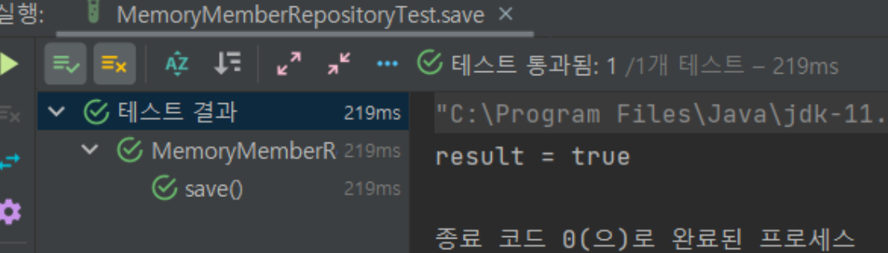

[//]: # (<🍃😕📃📁📗)
# 🍃06_회원 리포지토리 테스트 케이스 작성
## 

### 강의 목표😕
- MemoryMemberRepository 클래스의 기능을 검증하기 위한 테스트 케이스 작성
- JUnit을 사용하여 테스트 수행
- 각 테스트 케이스의 목적과 코드를 설명

> 각 메소드가 정상적으로 돌아가기 위해 검증

### 📁 테스트 환경 설정
1. 테스트 파일 위치: `src/test/java` 폴더 내 `repository` 폴더에 `MemoryMemberRepositoryTest` 클래스 파일 생성.
2. MemoryMemberRepository 인스턴스를 생성하여 테스트에 활용.

### 📃 테스트 케이스 작성 - save 메서드
```java
@Test
public void save() {
    Member member = new Member(); // Member 객체 생성
    member.setName("spring");

    repository.save(member); // Member 객체를 저장소에 저장

    // 저장한 Member와 저장소에서 가져온 Member가 동일한지 확인
    Member result = repository.findById(member.getId()).get();
    assertThat(result).isEqualTo(member);
}
```
- 🍃: `save` 메서드가 Member를 정상적으로 저장하는지 검증.
- 설명:
  - 새 Member 객체를 생성하고 저장소에 저장.
  - 저장한 Member와 저장소에서 가져온 Member를 비교하여 동일한지 검증.

### 테스트 케이스 작성 - findByName 메서드
```java
@Test
public void findByName() {
    Member member1 = new Member(); // Member 객체 생성 및 저장
    member1.setName("spring1");
    repository.save(member1);

    Member member2 = new Member(); // Member 객체 생성 및 저장
    member2.setName("spring2");
    repository.save(member2);

    // 이름으로 Member를 찾아와서 검증
    Member result = repository.findByName("spring1").get();
    assertThat(result).isEqualTo(member1);
}
```
- 🍃: `findByName` 메서드가 이름으로 Member를 정상적으로 찾아오는지 검증.
- 설명:
  - 두 개의 Member 객체를 생성하고 저장.
  - `findByName` 메서드를 사용하여 이름으로 Member를 검색하고 결과를 검증.

### 테스트 케이스 작성 - findAll 메서드
```java
@Test
public void findAll() {
    Member member1 = new Member(); // Member 객체 생성 및 저장
    member1.setName("spring1");
    repository.save(member1);

    Member member2 = new Member(); // Member 객체 생성 및 저장
    member2.setName("spring2");
    repository.save(member2);

    List<Member> result = repository.findAll(); // 모든 Member를 가져옴

    // 가져온 Member 리스트의 크기가 2인지 검증
    assertThat(result.size()).isEqualTo(2);
}
```
- 🍃: `findAll` 메서드가 저장된 모든 Member를 정상적으로 가져오는지 검증.
- 설명:
  - 두 개의 Member 객체를 생성하고 저장.
  - `findAll` 메서드를 사용하여 저장소에 있는 모든 Member를 가져온 후 크기를 검증.

### 테스트 케이스 작성 - clearStore 메서드
```java
@AfterEach // 각 테스트 메서드 수행 이후 실행
public void afterEach() {
    repository.clearStore(); // 저장소 내용 초기화
}
```
- 🍃: 각 테스트 메서드 실행 이후에 저장소 내용을 초기화하여 독립적인 테스트 보장.
- 설명: 각 테스트 메서드 수행 후, 저장소 내용을 초기화하는 `clearStore` 메서드를 실행.

### 전체 테스트 코드
```java
package repository;

import org.junit.jupiter.api.AfterEach;
import org.junit.jupiter.api.Test;
import spring.study1.domain.Member;
import spring.study1.repository.MemoryMemberRepository;

import java.util.List;

import static org.assertj.core.api.Assertions.assertThat;

class MemoryMemberRepositoryTest {

    MemoryMemberRepository repository = new MemoryMemberRepository();

    @AfterEach
    public void afterEach() {
        repository.clearStore();
    }

    @Test
    public void save() {
        Member member = new Member();
        member.setName("spring");

        repository.save(member);

        Member result = repository.findById(member.getId()).get();
        assertThat(result).isEqualTo(member);
    }

    @Test
    public void findByName() {
        Member member1 = new Member();
        member1.setName("spring1");
        repository.save(member1);

        Member member2 = new Member();
        member2.setName("spring2");
        repository.save(member2);

        Member result = repository.findByName("spring1").get();
        assertThat(result).isEqualTo(member1);
    }

    @Test
    public void findAll() {
        Member member1 = new Member();
        member1.setName("spring1");
        repository.save(member1);

        Member member2 = new Member();
        member2.setName("spring2");
        repository.save(member2);

        List<Member> result = repository.findAll();
        assertThat(result.size()).isEqualTo(2);
    }
}
```



### 요약
- `MemoryMemberRepository` 클래스의 기능을 검증하기 위한 테스트 케이스 작성.
- JUnit을 사용하여 테스트 수행.
- 각 테스트 케이스의 🍃과 코드 설명 포함.
- `@AfterEach` 메서드를 활용하여 각 테스트 이후 저장소 내용 초기화.
- 실무에서 자주 사용함