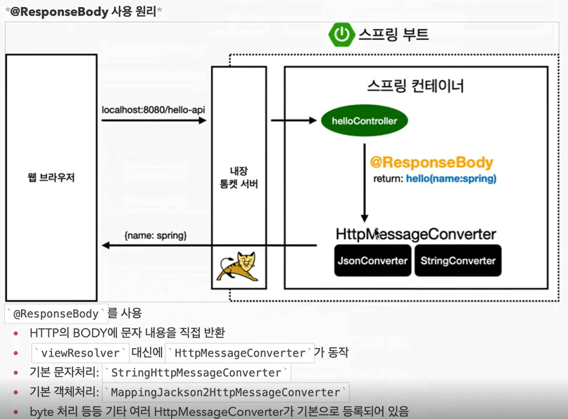

## API

API는 데이터를 JSON 형식으로 클라이언트로 전달하거나 서버 간에 데이터를 주고받는 방식이다.  
이를 통해 웹 어플리케이션에서 데이터를 손쉽게 처리할 수 있다.

## API 기초:

1. `HelloController` 파일에 새로운 컨트롤러 메서드를 추가하면,   
웹 어플리케이션에서 `localhost:8080/hello-string` 경로로 요청이 오면 해당 메서드가 호출된다.

2. 이 메서드는 `@RequestParam` 어노테이션을 사용하여 요청의 파라미터 중에서 `name` 값을 받아온다.

3. 받아온 `name` 값을 그대로 문자열로 반환한다.  
이 값은 HTTP 응답의 body에 담겨 클라이언트로 전송된다.

## API 활용:

1. 다음으로, 값을 JSON 형식으로 클라이언트에게 반환하는 방법을 살펴본다.

2. `HelloController`에 새로운 메서드 `helloApi`를 추가하면,    
이 메서드는 `@ResponseBody` 어노테이션을 사용하여 HTTP 응답의 body에 데이터를 직접 넣어준다.

3. 이 메서드는 `name` 값을 받아와서 `Hello` 객체에 넣고, 이 객체를 반환한다.    
`Hello` 클래스는 `name` 필드와 그에 대한 getter와 setter 메서드로 구성된다.

4. 클라이언트에서 `localhost:8080/hello-api` 경로로 요청을 보내면,   
서버는 `Hello` 객체를 JSON 형태로 만들어 응답한다.

 

 

## API 원리:

1. 클라이언트가 `localhost:8080/hello-api`에 요청을 보낸다.

2. 서버는 내장 톰켓 서버를 통해 해당 요청을 받는다.

3. 스프링 프레임워크는 `@ResponseBody` 어노테이션이 있는 컨트롤러 메서드를 찾는다.

4. 컨트롤러 메서드가 JSON 형태로 데이터를 반환하도록 되어 있으므로, 스프링은 HttpMessageConverter를 사용하여 객체를 JSON 형태로 변환한다.

5. JSON 형태로 변환된 데이터가 HTTP 응답의 body에 담겨 클라이언트로 전송된다.

이러한 방식을 통해 API를 활용하여 데이터를 주고받을 수 있다.

>- 근데 잘 안쓰는 방법이다. 주로 정적 컨텐츠나 MVC를 사용한다. 어??