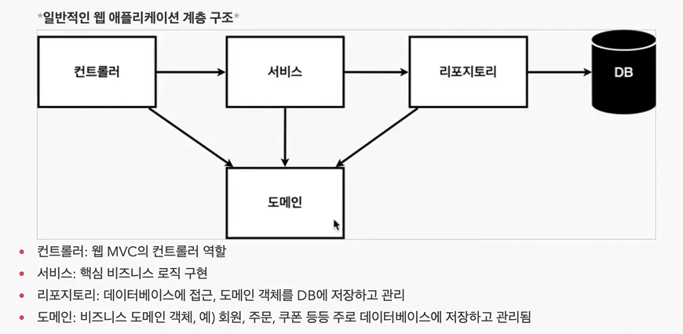
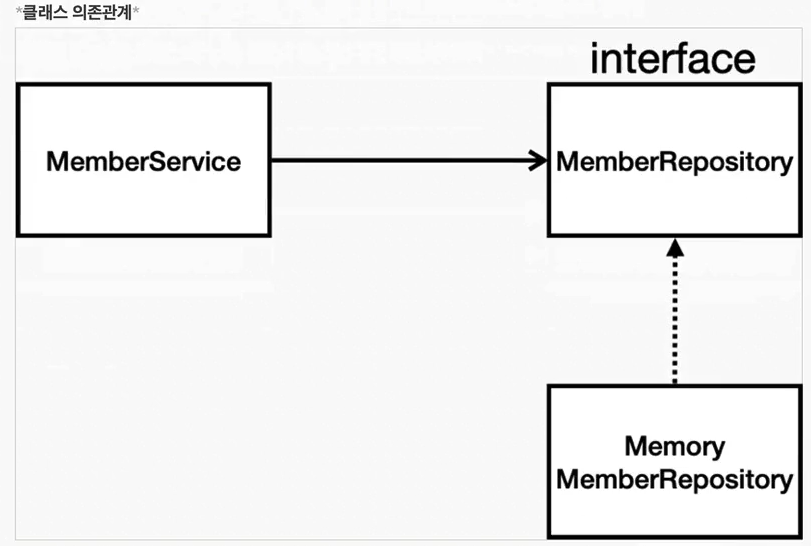

  [//]: # (<🍃😕📃📁📗)
# 🍃04_회원관리_백엔드


### 📗비즈니스 요구사항 정리
* 데이터 : 회원 ID, 이름   
* 기능 : 회원 등록, 조회   
* 아직 데이터 저장소가 선정되지 않음(가상의 시나리오)  

<br/>

### 📃일반적인 웹 애플리케이션 계층 구조




<br/>

### 📃클래스 의존관계




* 아직 데이터 저장소가 선정되지 않아서, 우선 인터페이스로 구현 클래스를 변경할 수 있도록 설계
* 데이터 저장소는 RDB. NoSQL 등등 다양한 저장소를 고민중인 상황으로 가정
* 개발을 진행하기 위해서 초기 개발 단계에서는 구현체로 가벼운 메모리 기반의 데이터 저장소 사용


<br/>

# 회원 관리 예제 - 스프링 빈과 의존관계
>회원 도메인과 리포지토리 만들기


## 정리
- 멤버 컨트롤러가 멤버 서비스를 통해 회원가입하고 데이터를 조회하는 의존관계를 설정한다.
- 멤버 컨트롤러, 멤버 서비스, 그리고 멤버 리포지토리를 스프링 빈으로 등록하여 의존관계를 정상적으로 설정한다.
- 스프링 빈 등록 방법은 컴포넌트 스캔과 자바 코드로 직접 등록하는 두 가지가 있다.

## 멤버 컨트롤러 생성
- 멤버 컨트롤러를 생성하여 의존관계를 만든다.
  - `src/main/java/spring.study1/controller/MemberController`
  - ```java
    package spring.study1.controller;

    import org.springframework.beans.factory.annotation.Autowired;
    import org.springframework.stereotype.Controller;
    import spring.study1.service.MemberService;
    
    @Controller // 스프링 컨테이너가 뜰 때 MemberController를 생성하고 관리 해줌
    public class MemberController {
    private final MemberService memberService;

    // MemberController를 생성할 때 호출
    @Autowired // spring이 memberService를 스프링 컨테이너에 있는 memberService를 가져다 연결시켜줌(의존관계 주입)
    public MemberController(MemberService memberService) {
        this.memberService = memberService;
    }
}
    
- `@Controller` 어노테이션을 사용하여 스프링 빈으로 등록한다.
- `@Autowired` 어노테이션을 사용하여 멤버 서비스와 의존관계를 주입한다.

## 스프링 컨테이너에 스프링 빈 연결
- 멤버 서비스를 스프링 빈으로 등록한다.
- `@Service` 어노테이션을 사용하여 스프링 빈으로 등록하고, 멤버 리포지토리와 의존관계를 주입한다.

## 스프링 빈 정리
- 스프링 빈을 등록하는 방법은 컴포넌트 스캔과 자바 코드로 직접 등록하기 두 가지가 있다.
- `@Controller`, `@Service`, `@Repository` 어노테이션을 사용하여 컴포넌트 스캔과 자동 의존관계 설정을 수행한다.

**참고:** 스프링 빈은 스프링 컨테이너에 등록되고 관리되며, 의존관계 주입을 통해 서로 연결된다.
